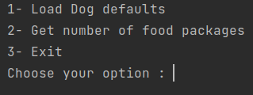
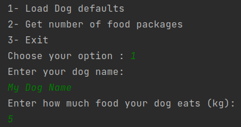
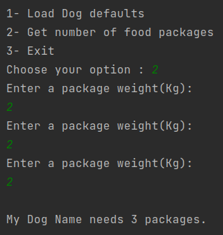
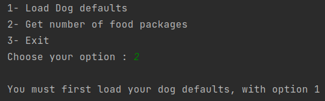

# Dogs App

Dogs app is a Java console application used to register your dog defaults and obtain the number of food packages you
need to buy.

## Clone

`git clone https://github.com/lditzel94/app-dogs.git`

## Usage

### - Running App menu

Running the main method will launch the follow menu:

### - Menu item 1

You must load the required data.

### - Menu item 2

You will be asked to load a package size until the total amount of food (kg) covered by the packages is equal or greater
than you dog needs.

## Existing Exceptions

An error will be thrown if you try to get option 2 without previously loading your dog defaults.

